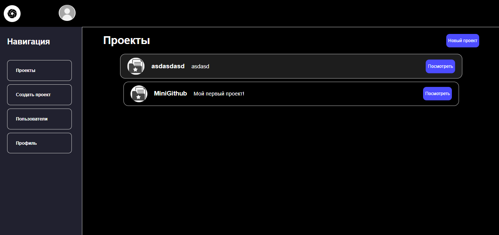

# Мини github на fastapi


## Для запуска
1. Клонируйте репозиторий:
   ```
   git clone https://github.com/AlisherAsd/MiniGithubFastApi.git
   cd MiniGithubFastApi
   ```

2. Создайте и активируйте виртуальное окружение:
   ```
   python -m venv venv
   # Для Windows:
   venv\Scripts\activate
   # Для Linux/Mac:
   source venv/bin/activate
   ```

3. Установите зависимости:
   ```
   pip install -r requirements.txt
   ```

4. Инициализируйте базу данных:
   ```
   python src/init_db.py
   ```

5. Запустите сервер:
   ```
   uvicorn src.main:app --reload
   ```

6. Откройте браузер и перейдите по адресу:
   ```
   http://127.0.0.1:8000/register
   ```
